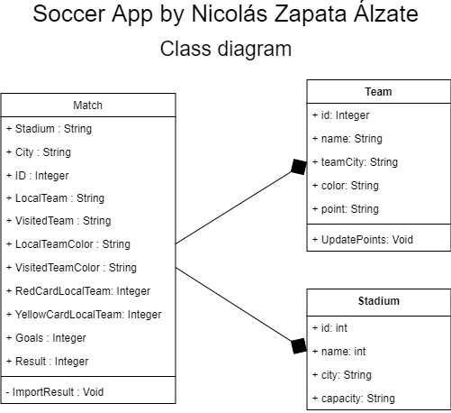

# MajorLeagueSoccerApp
<<<<<<< HEAD
You want see the result of your favorite soccer team? Choise the unofficial MLS app created by Nicolás Zapata Álzate with Java using NetBeans Enviroment. This app is created for the lab #1 of the UNIR's Course Advance Programing
## Code Documentation
the code is working with a basic main.java tha work for calling all methods, there's are 3 principal classes, **Match** **Team** and **Stadium**, The class diagram work like that 

=======
You want see your favorite soccer team? Choise the unofficial MLS app created by Nicolás Zapata Álzate with Java using NetBeans Enviroment. This app is created for the lab #1 of the UNIR's Course Advance Programing

>>>>>>> b9973dcd3887108da625f5ee72d3ae961dfb017f
