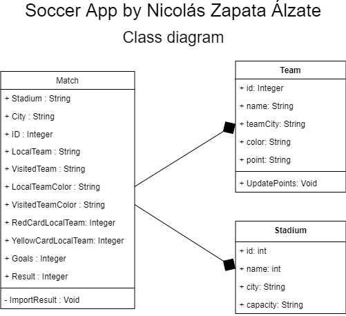
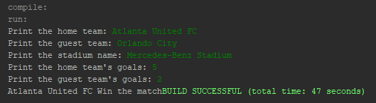
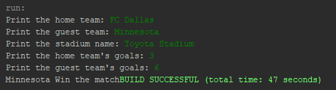
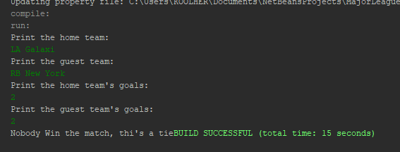

# MajorLeagueSoccerApp
You want see the result of your favorite soccer team? Choise the unofficial MLS app created by Nicolás Zapata Álzate with Java using NetBeans Enviroment. This app is created for the lab #1 of the UNIR's Course Advance Programing
## Code Documentation
The code is working with a basic main.java tha work for calling all methods, there's are 3 principal classes, **Match** **Team** and **Stadium**, The class diagram work like that: 



The main class is **MajorLeagueSoccerApp.java** that uses for print all the program.

## Match Class
The class match habe all variables of the match: goal, yellow and red cards, the result etc, and a function called *PrintResult* what print the match's result: 

```java
    /**
     * This method show the match's result
    */
    public void PrintResult(){
        try{
            if(homeTeamGoals > guestTeamGoals){
                System.out.print(homeTeam + " Win the match");
            }
            else if(guestTeamGoals > homeTeamGoals){
                System.out.print(guestTeam + " Win the match");
            }
            else if(homeTeamGoals == guestTeamGoals){
                System.out.print("Nobody Win the match, thi's a tie");
            }
        }catch(Exception exep){
            System.out.println("Result System failed: " + exep.getMessage());
        }
    }
```
## Team Class
Team is the class when is hosted all teams variables, this class have two constructors initializes: One using all paremeters
```java
    public Team (String Name, int ID, String TeamCity, String Color, int Points){
        this.name = Name;
        this.id = ID;
        this.teamCity = TeamCity;
        this.color = Color;
        this.points = Points;
    }
```
And the another using only name parameter:
```java
    public Team(String name){
        this.name = name;
    }
```
## Stadium Class
Is the Stadium were two teams play each other. This class have 2 constructor, one initializes all parameters 
```java
    public Stadium (String Name, int ID, String City, int Capacity){
        this.name = Name;
        this.id = ID;
        this.city = City;
        this.capacity = Capacity;
    }
```
And the Another initialize the name only
```java
    public Stadium(String name){
        this.name = name;
    }
```
## Screenshots




## The Executable
the jar file it's in the dist folder

